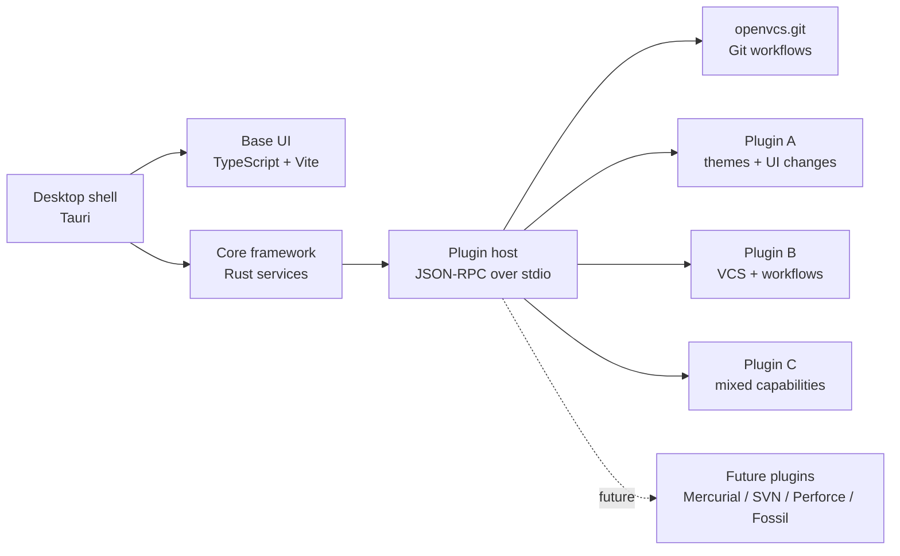

<p align="center">
  
</p>

<h1 align="center">OpenVCS</h1>

<p align="center">
  <strong>A desktop client for every VCS.</strong>
</p>

<p align="center">
  Plugin-based by design, starting with Git.
</p>

<div align="center">

[](https://github.com/Open-VCS/OpenVCS/actions/workflows/nightly.yml)
[](https://github.com/Open-VCS/OpenVCS/actions/workflows/beta.yml)
[](https://github.com/Open-VCS/OpenVCS/actions/workflows/publish-stable.yml)
[](LICENSE)

</div>

<p align="center">
  <a href="#overview">Overview</a>
  ·
  <a href="#quick-start">Quick Start</a>
  ·
  <a href="#features">Features</a>
  ·
  <a href="#screenshots">Screenshots</a>
  ·
  <a href="#architecture">Architecture</a>
  ·
  <a href="#roadmap">Roadmap</a>
  ·
  <a href="#contributing">Contributing</a>
</p>

---

## Overview

OpenVCS is a desktop version control client focused on **speed**, **clarity**, and **customisation**.

<p align="center">
  
</p>

The client itself stays **VCS-agnostic**. It provides the desktop shell, core framework, plugin runtime, and base UI; VCS support, themes, UI changes, and additional product features are provided by plugins. A single plugin can provide any combination of these capabilities. The first major release ships with the `openvcs.git` plugin so Git workflows can stabilise before other VCS support is explored.

> [!IMPORTANT]
> OpenVCS is in early development. Features, APIs, packaging, plugin behaviour, and UI details may change while the core Git workflow stabilises.

<table>
  <tr>
    <td align="center" width="33%">
      <h3>⚡ Fast by design</h3>
      <p>Rust and Tauri keep the app lightweight while still allowing native desktop integration.</p>
    </td>
    <td align="center" width="33%">
      <h3>🧩 Built to extend</h3>
      <p>VCS providers, UI extensions, themes, and extra features are delivered through plugins.</p>
    </td>
    <td align="center" width="33%">
      <h3>🌿 Git first</h3>
      <p>Git support comes from the built-in plugin, not from Git-specific client architecture.</p>
    </td>
  </tr>
</table>

---

## Project Status

| Area               | Status      | Notes                                                               |
| ------------------ | ----------- | ------------------------------------------------------------------- |
| **Git plugin**     | Active      | Built-in `openvcs.git` plugin using system Git execution            |
| **Linux AppImage** | Active      | Primary distribution target                                         |
| **Windows builds** | Supported   | Build support exists; reliability will continue improving           |
| **macOS builds**   | Not planned | Community interest may influence this later                         |
| **Flatpak**        | Test build  | Released from stable builds, but provided as experimental/test-only |
| **Themes**         | Early       | Themes are plugins and can change application styling               |
| **Plugins**        | Early       | Plugins can add, remove, or modify UI, themes, VCSs, and features   |
| **Multi-VCS**      | Planned     | Future VCS support should arrive through plugins                    |

---

## Quick Start

OpenVCS desktop builds are distributed through **GitHub Releases**.

### Download from GitHub Releases

| Build                     | Best for                 | Notes                                          |
| ------------------------- | ------------------------ | ---------------------------------------------- |
| **Latest stable release** | Most users               | Recommended default download                   |
| **Pre-release / nightly** | Testing upcoming changes | May contain regressions or incomplete features |
| **Source archive**        | Reviewing release source | Use the repository directly for development    |

1. Open the [latest release](https://github.com/Open-VCS/OpenVCS/releases/latest) on GitHub.
2. Download the appropriate asset for your platform.
3. Run the downloaded build locally.

### Linux AppImage

Download the latest AppImage from GitHub Releases, make it executable, and run it directly:

```bash
chmod +x OpenVCS-*.AppImage
./OpenVCS-*.AppImage
```

The AppImage can be stored anywhere. No installation step is required.

| Step            | Action                                                                  |
| --------------- | ----------------------------------------------------------------------- |
| Download        | Get the latest AppImage asset from GitHub Releases                      |
| Allow execution | Run `chmod +x OpenVCS-*.AppImage`                                       |
| Launch          | Run `./OpenVCS-*.AppImage`                                              |
| Update          | Download a newer AppImage from GitHub Releases and replace the old file |

### Windows

Download the Windows installer from GitHub Releases and run it like a standard desktop application installer.

| Step      | Action                                                                           |
| --------- | -------------------------------------------------------------------------------- |
| Download  | Open the latest GitHub Release and download the Windows installer asset          |
| Install   | Run the downloaded installer and follow the prompts                              |
| Launch    | Start OpenVCS from the Start menu or desktop shortcut                            |
| Update    | Download the newer Windows installer from GitHub Releases and run it again       |
| Uninstall | Remove OpenVCS from Windows Settings → Apps, or use the provided uninstall entry |

If Windows SmartScreen warns about the installer, verify that the file came from the official GitHub Release before choosing whether to continue.

### Build from source

For development builds, clone the repository and run OpenVCS through Tauri:

```bash
git clone https://github.com/Open-VCS/OpenVCS.git
cd OpenVCS
npm --prefix Frontend install
cd Backend
cargo tauri dev
```

### Flatpak

Flatpak packaging exists under `packaging/flatpak/`. Stable-channel Flatpak builds may be published, but they are provided as experimental test builds rather than a recommended install path. See the [Flatpak](#flatpak) section before relying on it for regular use.

> [!NOTE]
> Desktop builds currently continue to use the legacy shared `OpenVCS` configuration and plugin directories.

---

## Release Channels

| Channel     | Intended use                       | Stability                     |
| ----------- | ---------------------------------- | ----------------------------- |
| **Stable**  | General use and manual testing     | Most reliable available build |
| **Beta**    | Previewing upcoming release work   | May contain regressions       |
| **Nightly** | Testing latest development changes | Experimental                  |

---

## Features

OpenVCS keeps the README short. The full feature list lives in [docs/Features.md](docs/Features.md).

Highlights:

- Plugin-first and VCS-agnostic architecture
- Plugins can add, remove, or modify UI
- Themes are plugins
- Additional features and VCS backends are plugins too

---

## Screenshots

<table>
  <tr>
    <td align="center" width="50%">
      <br>
      <strong>Add existing repository</strong>
    </td>
    <td align="center" width="50%">
      <br>
      <strong>Settings</strong>
    </td>
  </tr>
</table>

<table>
  <tr>
    <td align="center">
      <br>
      <strong>Plugin list</strong>
    </td>
  </tr>
</table>

> [!NOTE]
> The interface is still evolving while the core workflows stabilise.
> The settings modal includes an on-by-default commit-summary restriction toggle that caps the commit title box at 72 characters.

---

## Architecture

OpenVCS is a plugin-first desktop framework. The client provides the application shell, core services, plugin host, and base UI. VCS integrations, themes, UI customisations, and additional features are supplied by plugins.

Plugin capabilities are composable rather than split into strict plugin types. A single plugin can add themes, modify UI, provide a VCS integration, add workflows, or combine those responsibilities.

The client should remain VCS-agnostic: Git is supported by the built-in `openvcs.git` plugin, not by hard-coding Git as the application's core model.



### Architecture responsibilities

| Layer              | Technology        | Responsibility                                               |
| ------------------ | ----------------- | ------------------------------------------------------------ |
| **Desktop shell**  | Tauri             | Windowing, app lifecycle, frontend/backend bridge            |
| **Base UI**        | TypeScript + Vite | Core interface, interaction patterns, and plugin surfaces    |
| **Core framework** | Rust              | Native services, filesystem access, process execution        |
| **Plugin host**    | Rust + Node.js    | Load npm/local plugins and communicate over JSON-RPC stdio   |
| **Plugins**        | npm / local path  | Add any mix of VCS support, themes, UI changes, and features |

### Repository layout

```text
.
├── Backend/              # Rust + Tauri backend, native logic, and app entry point
├── Frontend/             # TypeScript + Vite frontend
├── docs/                 # UX, plugin, architecture, and packaging documentation
├── packaging/flatpak/    # Experimental Flatpak manifests and notes
├── scripts/              # Build and plugin-materialisation helpers
├── Cargo.toml            # Rust workspace manifest
├── Justfile              # Common build/test/fix commands
├── LICENSE
└── README.md
```

### Design principles

| Principle                   | Direction                                                                                                    |
| --------------------------- | ------------------------------------------------------------------------------------------------------------ |
| **VCS agnostic core**       | The client framework should not assume Git or any other VCS as the core model.                               |
| **Everything is a plugin**  | VCS providers, themes, UI changes, and extra workflows should be delivered by plugins.                       |
| **Composable capabilities** | A plugin can provide one capability or many; themes, UI, VCSs, and features are not separate plugin classes. |
| **Extensible UI**           | Plugins can add, remove, or modify UI without requiring a fork of the client.                                |
| **Themes are plugins**      | Themes are plugin capabilities and can change styles, presentation, and visual assets.                       |
| **Visible operations**      | VCS commands and logs should be inspectable rather than hidden behind vague progress states.                 |

---

## Build from Source

### Requirements

| Requirement                                     | Purpose                             |
| ----------------------------------------------- | ----------------------------------- |
| [Rust](https://www.rust-lang.org/tools/install) | Backend and Tauri application       |
| [Cargo](https://doc.rust-lang.org/cargo/)       | Rust package manager and build tool |
| [Node.js](https://nodejs.org/)                  | Frontend toolchain                  |
| [npm](https://www.npmjs.com/)                   | Frontend dependency installation    |
| [Git](https://git-scm.com/)                     | Required by the current Git plugin  |
| [just](https://github.com/casey/just)           | Recommended command runner          |

### Developer setup

```bash
git clone https://github.com/Open-VCS/OpenVCS.git
cd OpenVCS
npm --prefix Frontend install
cd Backend
cargo tauri dev
```

### Build commands

| Command                 | Description                      |
| ----------------------- | -------------------------------- |
| `just tauri-build`      | Build a stable production bundle |
| `just tauri-build beta` | Build a beta channel bundle      |
| `just build stable`     | Build stable channel output      |
| `just build beta`       | Build beta channel output        |
| `just build nightly`    | Build nightly channel output     |
| `cargo build`           | Compile the Rust workspace only  |

These commands wrap the Tauri build flow and set `NO_STRIP=true` to avoid AppImage `linuxdeploy` strip failures on newer Linux toolchains.

---

## Flatpak

A Flatpak manifest exists under:

```text
packaging/flatpak/
```

| Limitation                                 | Impact                                                                  |
| ------------------------------------------ | ----------------------------------------------------------------------- |
| Sandbox does not currently provide `git`   | OpenVCS currently relies on system Git through plugin execution         |
| Frontend assets must be packaged correctly | Otherwise the app may show a blank window or localhost connection error |
| Flatpaks are stable-channel test builds    | They may be released, but remain experimental and are not recommended   |

In short: Flatpak users are helping test the packaging path. Expect rough edges.

For local Flatpak build notes, see:

[packaging/flatpak/README.md](packaging/flatpak/README.md)

---

## Development Workflow

### Internal paths

| Path                               | Purpose                                     |
| ---------------------------------- | ------------------------------------------- |
| `Backend/src/core/`                | Shared VCS models and traits                |
| `Backend/src/plugin_runtime/`      | Node.js plugin host and JSON-RPC transport  |
| `Backend/tauri.conf.json`          | Tauri configuration and precommand hooks    |
| `openvcs.plugins.json`             | Channel-aware built-in plugin configuration |
| `openvcs.plugins.local.json`       | Optional local plugin override              |
| `target/openvcs/built-in-plugins/` | Materialised built-in plugin output         |

### Notes

* Tauri precommands intentionally use an explicit hook `cwd` of `Backend/`.
* This prevents Tauri from resolving hooks from nested plugin directories.
* Built-in plugins are materialised from `openvcs.plugins.json` before app builds.
* Local development can override the active plugin list with `openvcs.plugins.local.json`.

---

## Testing and Quality Checks

### Main commands

| Command                                                       | Runs                                                 |
| ------------------------------------------------------------- | ---------------------------------------------------- |
| just test                                                     | Full project test/check flow                         |
| just fix                                                      | Formatting, Clippy fixes, and frontend type checking |
| cargo fmt --all                                             | Rust formatting                                      |
| cargo fmt --all -- --check                                  | CI formatting check                                  |
| cargo clippy --all-targets --all-features -- -D warnings    | CI lint check                                        |
| npm --prefix Frontend exec tsc -- -p tsconfig.json --noEmit | Frontend type checking                               |
| npm --prefix Frontend test                                  | Frontend tests                                       |

### just test includes

| Step                     | Purpose                |
| ------------------------ | ---------------------- |
| cargo test --workspace   | Rust workspace tests   |
| Frontend typecheck       | TypeScript correctness |
| Frontend tests           | Vitest unit tests      |

---

## Roadmap

### Near term

| Item                                                     | Status |
| -------------------------------------------------------- |:------:|
| Stabilise core Git workflows                             | ✅     |
| Improve Linux AppImage installation and update behaviour | ✅     |
| Improve Windows build reliability                        | ✅     |
| Refine the main repository UI                            | ✅     |
| Expand backend/frontend test coverage                    | ✅     |

### Medium term

| Item                                                | Status |
| --------------------------------------------------- |:------:|
| Harden plugin loading and plugin configuration      | 🧭     |
| Improve theme support                               | 🧭     |
| Add more keyboard-first workflows                   | 🧭     |
| Improve merge and conflict resolution UX            | 🧭     |
| Expand documentation for plugin and backend authors | 🧭     |

### Long term

| Item                                                          | Status |
| ------------------------------------------------------------- |:------:|
| Add at least one non-Git VCS plugin                           | 🧭     |
| Validate the VCS-agnostic client model with non-Git workflows | 🧭     |
| Explore plugin and theme discovery flows                      | 🧭     |
| Explore a plugin/theme store                                  | 🧭     |
| Mature OpenVCS into a multi-VCS desktop client                | 🧭     |

Legend: ✅ active · 🧭 planned/exploratory

---

## Project Repositories

| Repository                                                                   | Purpose                                    |
| ---------------------------------------------------------------------------- | ------------------------------------------ |
| [Open-VCS](https://github.com/Open-VCS)                                    | GitHub organisation                        |
| [OpenVCS-Plugin-Git](https://github.com/Open-VCS/OpenVCS-Plugin-Git)       | Git VCS plugin implementation              |
| [OpenVCS-SDK](https://github.com/Open-VCS/OpenVCS-SDK)                     | SDK, runtime helpers, and shared contracts |
| [OpenVCS-Plugin-Themes](https://github.com/Open-VCS/OpenVCS-Plugin-Themes) | Theme plugin work                          |
| [ExamplePlugins](https://github.com/Open-VCS/ExamplePlugins)               | Example plugin implementations             |
| [PluginTemplate](https://github.com/Open-VCS/PluginTemplate)               | Starter template for new plugins           |

---

## Contributing

OpenVCS is open source and community-driven. Contributions are welcome across code, design, testing, documentation, and product feedback.

| Contribution type     | Examples                                                   |
| --------------------- | ---------------------------------------------------------- |
| **Bug reports**       | Broken workflows, crashes, packaging issues                |
| **Feature proposals** | New Git workflows, UX improvements, plugin ideas           |
| **Design feedback**   | Layout, accessibility, theme direction, interaction polish |
| **Backend work**      | Git improvements, future VCS adapters, core contracts      |
| **Frontend work**     | UI workflows, state handling, keyboard-first flows         |
| **Documentation**     | Build notes, plugin notes, architecture explanations       |
| **Themes/plugins**    | Theme prototypes and early plugin experiments              |

A dedicated `CONTRIBUTING.md` is planned. Until then, please open an issue or discussion before making large changes.

---

## Recommended IDE Setup

| Tool                                                                                            | Purpose                   |
| ----------------------------------------------------------------------------------------------- | ------------------------- |
| [Visual Studio Code](https://code.visualstudio.com/)                                            | Recommended editor        |
| [Tauri extension](https://marketplace.visualstudio.com/items?itemName=tauri-apps.tauri-vscode)  | Tauri development support |
| [rust-analyzer](https://marketplace.visualstudio.com/items?itemName=rust-lang.rust-analyzer)    | Rust language support     |
| [TypeScript ESLint](https://marketplace.visualstudio.com/items?itemName=dbaeumer.vscode-eslint) | Frontend linting support  |

---

## FAQ

<details>
<summary><strong>Is OpenVCS Git-only?</strong></summary>

Today, the first supported backend is Git through the built-in `openvcs.git` plugin. The long-term architecture is intended to support additional VCS backends.

</details>

<details>
<summary><strong>Does OpenVCS require system Git?</strong></summary>

Yes. The current Git plugin executes against the system Git installation.

</details>

<details>
<summary><strong>Is Flatpak supported?</strong></summary>

Flatpak builds may be released from the stable channel, but they are provided as experimental test builds. The current reliance on system Git creates sandboxing limitations, so expect rough edges.

</details>

<details>
<summary><strong>Can stable and nightly builds be installed together?</strong></summary>

Yes. Pre-release AppImage installs use a separate launcher and install path when the selected release is branded as beta or nightly.

</details>

<details>
<summary><strong>Are standalone theme zip packs supported?</strong></summary>

No. OpenVCS currently supports built-in themes and plugin-provided themes, but not standalone theme `.zip` packs.

</details>

---

## License

OpenVCS is licensed under the [GPL-3.0](LICENSE).
